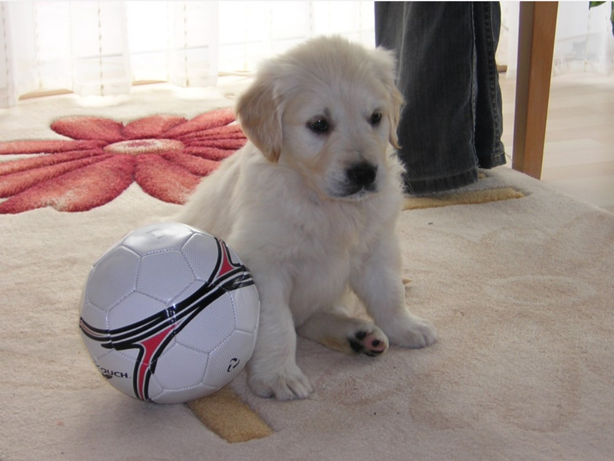
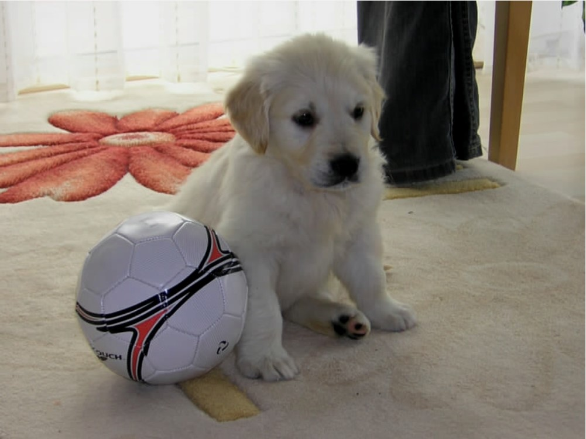

# AVDP

The project consists in a JPEG **encoder** and **decoder** :camera:.

The **encoder** does the following:

- Reads a PPM-3 format image
- Divides the image into 8x8 pixels blocks
- DCT (Discrete Cosine Transform) on the 8X8 pixels blocks
- Quantization on the 8X8 pixels blocks
- Entropy Encoding (only ZigZag parsing and run-length encoding, NOT Huffman encoding)

The **decoder** does the oposite steps of the encoder in reversed order (Entropy Decoding, inverse Quantization, etc.).

The JPEG image is kept only in memory during the program execution. At the end, a PPM-3 image is saved as a result of the **decoding**. The result image clearly shows how the quality of an image deteriorates when using JPEG.

Before (left) and after (right) the **encoding** & **decoding** process.

 

## How to run

Open a terminal inside the `src` folder and just execute the following command:

`python ./src/main.py`

The decoded image will be saved in `/res/images/processing/decoded_rgb.ppm`.

In order to change the image to be processed, change the `file_name` variable inside `src/main.py` (line 3) to the path which is pointing to the desired image.

***

More details regarding the project can be found [here](http://www.cs.ubbcluj.ro/~forest/pdav/labs.html).

The project was developed with Python :heart:.
